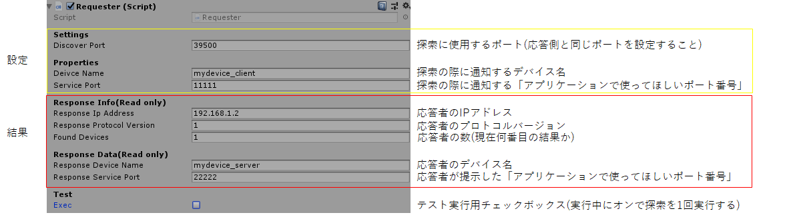
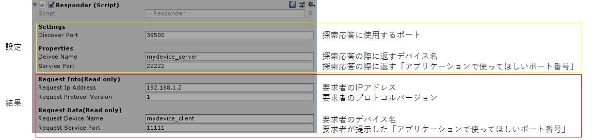

# 仕様

## EasyDeviceDiscoveryProtocolClient.Requester
GameObjectとして配置してください。  
探索の要求、応答の受信を行います。
  
</img>  
  
#### 準備
discoverPortには、探索に使用するポートを設定します。既定は39500  
deivceNameには、自分を表す名称を設定します。必ずアプリケーション固有の設定をしてください。  
servicePortには、通信相手からアクセスしてほしい通信用ポートを設定します。必ずアプリケーション固有の設定をしてください。  
### 探索
execをtrueにするか、 StartDiscover(Action OnDeviceFound)を叩くと探索を開始します。  
デバイスが見つかる度にOnDeviceFoundがコールされます。  

### 結果
responseIpAddressが、応答を返してきたResponderのIPアドレスです。  
responseDeviceNameが、Responderの名称です。  
responseServicePortが、Responderが使用してほしいと通知してきている通信用ポートです。  

## EasyDeviceDiscoveryProtocolClient.Responder
GameObjectとして配置してください。  
探索要求の受信、応答の送信を行います。  
  
</img>  
  
### 準備
discoverPortには、探索に使用するポートを設定します。既定は39500  
deivceNameには、自分を表す名称を設定します。必ずアプリケーション固有の設定をしてください。  
servicePortには、通信相手からアクセスしてほしい通信用ポートを設定します。必ずアプリケーション固有の設定をしてください。

### 待受
gameObjectがEnableな限り待ち受け続けます。
探索要求を受ける度にOnRequestedがコールされます。

### 結果
requestIpAddressが、探索元のRequesterのIPアドレスです。  
requestDeviceNameが、Requesterの名称です。  
requestServicePortが、Requesterが使用してほしいと通知してきている通信用ポートです。  

